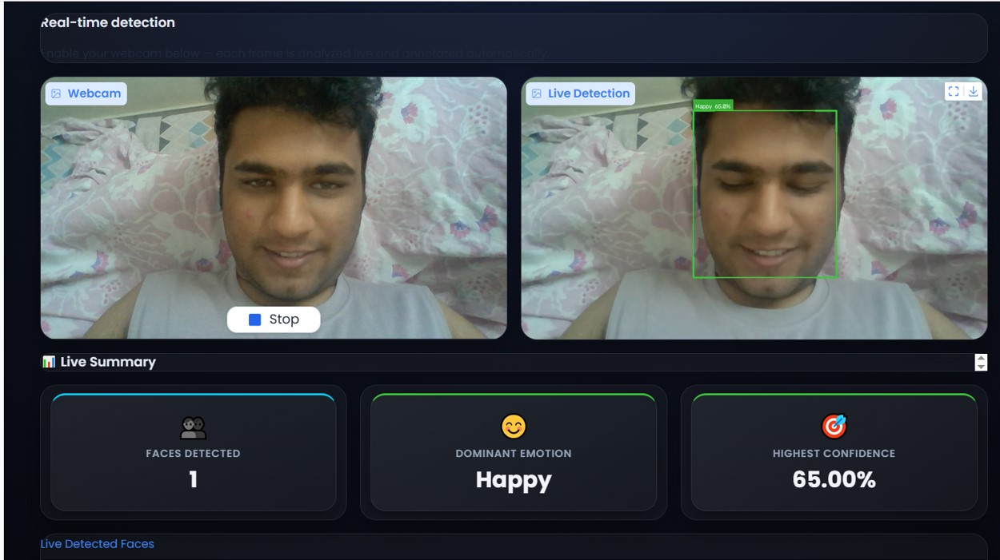
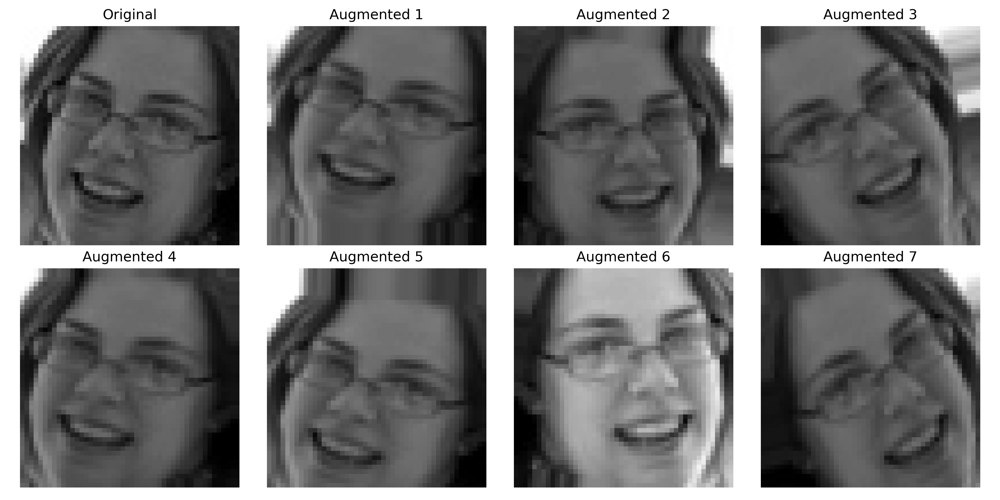

# 😊 AI Face Emotion Recognition

> Detect human emotions from facial images and live webcam using Deep Learning, TensorFlow, OpenCV YuNet, and Gradio.

An AI-powered facial emotion recognition system that detects human faces using **OpenCV YuNet** and classifies emotions using a **Convolutional Neural Network (CNN)** trained on the **FER-2013** dataset. The application supports both **image upload** and **real-time webcam emotion detection** through an interactive Gradio interface.

---

## ✨ Features

- 😊 Recognizes **7 facial emotions**
  - Angry
  - Disgust
  - Fear
  - Happy
  - Neutral
  - Sad
  - Surprise
- 👤 Automatic face detection using OpenCV YuNet
- 📷 Emotion prediction from uploaded images
- 🎥 Real-time webcam emotion recognition
- 📊 Displays confidence score for each detected face
- 📥 Download annotated prediction results
- 🎨 Modern and interactive Gradio user interface

---

## 🛠 Tech Stack

| Category | Technologies |
|----------|--------------|
| Language | Python 3.11 |
| Deep Learning | TensorFlow, Keras |
| Computer Vision | OpenCV (YuNet) |
| Numerical Computing | NumPy |
| User Interface | Gradio |

---

## 📂 Project Structure

```text
AI-Face-Emotion-Recognition/
│
├── app.py
├── emotion_analyzer.py
├── face_detector.py
├── predict.py
├── preprocess.py
├── requirements.txt
├── README.md
├── .gitignore
│
├── models/
│   ├── best_emotion_model.keras
│   └── face_detection_yunet_2023mar.onnx
│
└── screenshots/
    ├── image1.jpg
    ├── image2.jpg
    └── augmentation_examples.png
```

---

## 📸 Application Demo

### Image Upload Detection


---

### Live Webcam Detection



---

### Data Augmentation

Data augmentation techniques such as rotation, zoom, translation, and brightness adjustments were used during training to improve the model's generalization.



---

## 🧠 Model Information

- **Dataset:** FER-2013
- **Model:** Convolutional Neural Network (CNN)
- **Framework:** TensorFlow / Keras
- **Face Detection:** OpenCV YuNet
- **Number of Emotion Classes:** 7

---

## 📊 Model Performance

| Metric | Value |
|--------|------:|
| Validation Accuracy | **63%** |
| Emotion Classes | **7** |
| Dataset | FER-2013 |

---

## 🚀 Installation

Clone the repository

```bash
git clone https://github.com/aryan7189jain/AI-Face-Emotion-Recognition.git
```

Navigate to the project directory

```bash
cd AI-Face-Emotion-Recognition
```

Install the required dependencies

```bash
pip install -r requirements.txt
```

Run the application

```bash
python app.py
```

---

## 💻 Usage

1. Launch the Gradio application.
2. Upload an image or switch to the **Live Webcam** tab.
3. The system automatically detects faces.
4. Each detected face is classified into one of seven emotions.
5. The predicted emotion and confidence score are displayed.
6. Download the annotated output image if required.

---

## 🔮 Future Improvements

- Improve accuracy using transfer learning.
- Support video file emotion analysis.
- Add emotion analytics dashboard.
- Deploy the application as a cloud-hosted web service.
- Optimize inference speed for edge devices.

---

## 👨‍💻 Author

**Aryan Jain**

- 📧 Email: aryan7189jain@gmail.com
- 💼 LinkedIn: https://www.linkedin.com/in/aryan-jain-211037327
- 💻 GitHub: https://github.com/aryan7189jain

---

⭐ If you found this project useful, consider giving it a star on GitHub.
